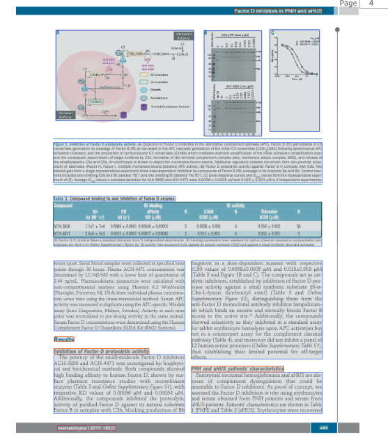
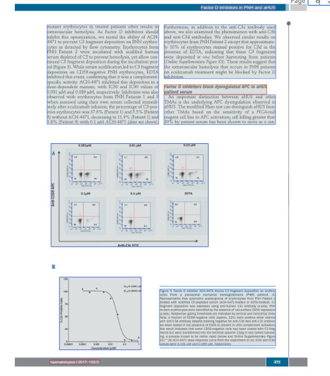

# Engineering Task

## Background

Ingestion is a core part of our product. Inventors upload documents — PDFs, Word files, papers, lab reports — and we process them to extract structured content needed for a patent application.

One key step is figure extraction: we use an ML pipeline to detect figure regions in PDFs, crop them, and cluster nearby regions into single figures before surfacing them to the user for review via a web UI. Users can then add captions, numbers, and labels before those figures go into a draft.

---
## The Problem

Clustering is a tradeoff — too aggressive and unrelated figures get merged, too conservative and panels that belong together get split. **Sometimes two or more extracted items should be one figure.** For example, sub-panels that share a single figure caption may appear as separate entries in the UI. Users need a way to **merge** those items into a single asset, with no duplicate entries for the pieces that were merged.

For example, on the page below the pipeline identifies three separate regions — and since they are close enough, clustering correctly groups panels A, B, and C into one figure.



But when panels are spaced further apart, clustering fails. Below, **Figure 3** has two panels — **A** (flow cytometry scatter plots) and **B** (a dose-response curve) — that end up as two separate entries in the UI.



---

## The Task

**Design and implement a merge feature** that lets a user combine two extracted images into one. Figure 3 from the example above (panels A and B appearing as separate entries) is the concrete case this feature should solve.

You are given:
- A working Flask backend (`server.py`) that serves the state and images
- A working frontend (`image-view-tester.html`) that renders the review UI
- The state structure (see below)

### State structure

```json
{
  "EXTRACTED_IMAGE_1": {
    "path": "image1.png",
    "number": "",
    "tag": "keep",
    "readable": 1,
    "captions": "",
    "callout_numbers": {},
    "include": true,
    "page": 1,
    "dpi": 200,
    "page_width_px": 1717,
    "page_height_px": 2268,
    "bbox_normalized": {
      "Height": 0.03869270533323288,
      "Left": 0.08897125720977783,
      "Top": 0.08931931853294373,
      "Width": 0.05823129415512085
    }
  },
...
}
```

### What we expect

**Frontend:**
- A way for the user to select one or more images to merge with the current one
- The merged result should replace the current image in the UI
- The merged images should be removed from the state and image list

**Backend:**
- A `/merge` endpoint that accepts two or more image keys, combines them, saves the result, and updates the state. Example request body:
```json
  { "keys": ["EXTRACTED_IMAGE_5", "EXTRACTED_IMAGE_7"] }
```
- Think carefully about how you stitch the images together — the right approach may depend on the spatial relationship between panels, and naive solutions can produce poor results

---

## What we're looking for

- **Product thinking**: is the merge action intuitive and easy to trigger, but hard to do accidentally?
- **Technical reasoning**: how do you decide to stitch? Vertical stack, horizontal, something else? Think beyond just this example — what's the general case?
- **Data integrity**: what happens to the state after a merge? Which image's metadata is kept? Are there edge cases?
- **Code quality**: clean, readable, and reasonably structured

---

## Deliverables

1. Updated `server.py` with the `/merge` endpoint (state + files stay consistent)
2. Updated `image-view-tester.html` with the merge UI
3. Brief notes (bulletpoints are fine): approach, tradeoffs, what you’d improve with more time.
---

## Setup

```bash
python -m venv venv
source venv/bin/activate
pip install -r requirements.txt
python server.py
# open http://localhost:5000
```

**Requirements:**
```
flask
flask-cors
pymupdf
pillow
```

